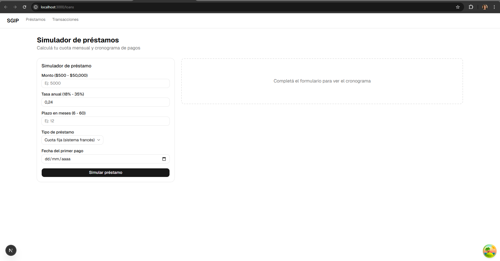
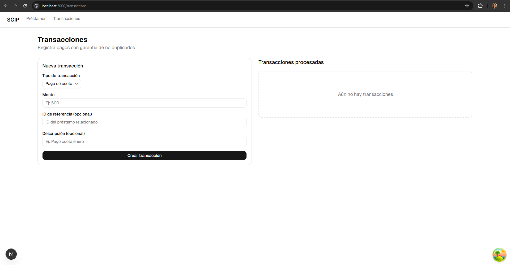

## SGIP Frontend

## 1. Descripción del proyecto

Este proyecto implementa el frontend del Sistema de Gestión de Inversiones y Préstamos (SGIP).
Permite a los usuarios:

- Simular préstamos
- Solicitar préstamos
- Visualizar cronogramas de pago
- Gestionar transacciones

El enfoque principal fue construir una interfaz clara, modular y alineada con el backend desarrollado.

## 2. Inicio rápido

### Pre-requisitos

- Node.js
- Backend SGIP ejecutandose (.NET)

### Clonar repositorio

```bash
git clone <repo-url>
cd sgip-frontend
```

### Restaurar dependencias

```bash
npm install
```

### Variables de entorno

1. Crear archivo `.env.local`

```bash
NEXT_PUBLIC_API_URL=http://localhost:5189
```

### Levantar el proyecto

```bash
npm run dev
```

Abrir en el navegador:

```
http://localhost:3000
```

## 3. Arquitectura

El frontend sigue una arquitectura basada en features:

```
src/
├── app/                    # App Router de Next.js
├── features/               # Módulos por dominio
│   ├── loans/
│   │   ├── components/
│   │   ├── hooks/
│   │   ├── services/
│   │   └── types/
│   ├── portfolio/
│   └── transactions/
├── shared/                 # Componentes reutilizables
│   ├── components/
│   ├── hooks/
│   └── utils/
└── core/                   # Configuración y providers
```

## 4. Decisiones técnicas

#### TanStack Query

Se utilizó para manejar el estado del servidor.

Motivo:

- Manejo automático de cache
- Estados de loading y error
- Refetch de datos

#### React Hook Form + Zod

Motivo:

- Validaciones declarativas
- Integración con formularios complejos
- Reutilización de esquemas

#### Axios

Motivo:

- Centralizar llamadas HTTP
- Manejo de interceptores
- Adaptar respuestas del backend

#### shadcn/ui

Motivo:

- Componentes reutilizables
- UI consistente
- Desarrollo rápido

Componentes usados:

- Button
- Input
- Card
- Table
- Badge
- Select
- Form

## 5. Testing

Actualmente no se implementaron tests en frontend.

Motivo: Se priorizó la implementación de funcionalidades críticas del negocio en backend.

## Supuestos y Limitaciones

- No se implementó autenticación
- No se implementó dashboard (caso 3)
- No se implementó reconciliación (caso 4)

Se priorizaron los casos de uso principales:

- Simulación de préstamos
- Solicitud de préstamos
- Gestión de transacciones
  Motivo: Estos representan el core del sistema financiero.

## 6. Evidencias

